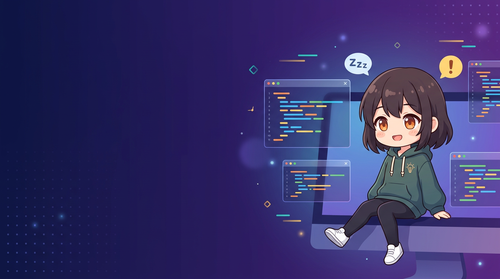

<div align="center">



# Duty On · 开工啦 — AI Task Pet + Desk Companion Screen

**Your favorite character watches your AI IDE, so you don't have to.**

[](LICENSE)
[-blue)]()
[]()
[](https://github.com/marine841023/duty-on/releases)

**English** · [简体中文](README.zh-CN.md)

### 🚀 v2.0 — Native C++ desktop pet + hardware companion screen

> **Made for Chinese Trae users** — native Trae CN / TraeCode CN window-title
> detection, multi-root workspace suffix stripping, 8 languages with
> Simplified Chinese first.
>
> **Desktop:** the whole app is a **single native C++ process** — no WebView,
> no browser runtime. One `dutyon-pet.exe` embeds the HTTP server, state
> machine, IDE scanner and metrics sampler, and renders Live2D/GIF pets
> natively with GLFW + OpenGL + Cubism SDK (~116 MB measured with a Live2D
> pet on screen, vs ~465 MB for the 1.x WebView version).
>
> **Hardware device (new):** a **desk companion screen for AI tasks** built
> from the same C++ codebase — a small display that shows a Live2D character
> acting out the live status of every AI session on your PC (💤 sleeping /
> ⚡ working / 🔔 alert) plus a task list and clock. ARM Linux (DRM/GBM
> direct rendering, no X11), Wi-Fi provisioning with a captive portal,
> 6-digit pairing code with the PC, and an automatic photo-frame mode when
> the PC is away.

**Downloads**
| Platform | Link |
|---|---|
| 🖥 Windows desktop v2.0.10 | [GitHub Releases](https://github.com/marine841023/duty-on/releases) · [Gitee Releases](https://gitee.com/megrezsoft/duty-on/releases) |
| 📟 Device source | [v2.0-dev branch](https://github.com/marine841023/duty-on/tree/v2.0-dev), `device/` dir (cross-compiled — see "Device build" below) |

</div>

---

## What is it?

Running AI agents in several IDE windows at once? Stop Alt-Tabbing to check
whether they're still working, done, or waiting for your confirmation.
**Duty On** condenses the live status of every **Trae** / Qoder / Cursor /
Codex / OpenCode session into one character:

- 💤 **Sleeping** — everything is idle (she naps, Zzz…)
- ⚡ **Working** — an AI task is running right now
- 🔔 **Alert** — an agent needs your confirmation **right now**

**Two form factors, one codebase:**

| | 🖥 Desktop (Windows) | 📟 Device (ARM Linux screen) |
|---|---|---|
| Form | transparent floating Live2D/GIF pet | standalone small screen (480×800 portrait / 800×480 landscape) |
| Rendering | GLFW + OpenGL + ImGui | DRM/GBM direct GLES3 (no X11) |
| Link | embedded local backend | Wi-Fi polling of the PC's `/api/status` |
| Characters & config | shared `~/.dutyon/` | auto-synced from the PC (models, audio) |
| Extras | status bar, system monitor, mini mode | task list + clock + photo-frame mode |

## 📟 The hardware companion screen

A low-cost ARM board (e.g. Orange Pi Zero 2W, H616 quad-core A53) with a
small display becomes a **desk companion screen for your AI tasks**:

- **Live status acting** — the Live2D character switches motions with the
  aggregate state of all AI sessions on the PC (sleeping / working / alert),
  with task-event chimes
- **Two-section layout** — Live2D character on top, task list below (project
  name + status badge per row); multi-task mode splits dynamically and keeps
  the character vertically centered
- **Clock + status icons** — themed clock/date, Wi-Fi / PC link icons in the
  corner (disconnected icons get a big red X overlay — readable at a glance)
- **Wi-Fi provisioning** — the device opens a hotspot (`DutyOn-XXXX`) on
  boot; connect your phone and the **captive portal pops up automatically**
  to pick your home Wi-Fi. No keyboard needed. The PC can later send a
  "re-provision" command to switch networks
- **Pairing & sync** — the screen shows a 6-digit pairing code; enter it on
  the PC (right-click the pet → Device → Pair). Characters, Live2D models
  and state audio sync automatically from the PC
- **Photo-frame mode** — boots into a photo slideshow when no PC is
  connected; switches back once paired
- **Sound** — HDMI audio out; start/end/alert chimes per task, with custom
  audio binding per state

### Device build (local cross-compilation)

Cross-compile on a Windows host and push the binary straight to the device —
no on-device compiling:

```bash
# 1. Place the Arm GNU 13.2 toolchain under tools/cross/ (see the notes in
#    device/cmake/aarch64-toolchain.cmake)
# 2. Pull a sysroot (EGL/GLES/GBM/DRM headers + libs) from the device into
#    device/sysroot/
# 3. Configure + build (output: device/build-cross/dutyon-pet, a single
#    ~14 MB file)
cmake -G Ninja -S device -B device/build-cross ^
  -DCMAKE_TOOLCHAIN_FILE=device/cmake/aarch64-toolchain.cmake ^
  -DCMAKE_BUILD_TYPE=Release -DCPR_ENABLE_SSL=OFF
cmake --build device/build-cross -j
# 4. Deploy (scp -> on-device deploy.sh -> service restart, ~1 minute)
powershell .userdata/deploy-cross.ps1
```

> Reference hardware: Orange Pi Zero 2W (H616) + Debian 13 + HDMI display.
> The Cubism Native SDK must be placed manually at
> `device/third_party/CubismNativeSdk/`.

## 🖥 Desktop features

- **🎬 Custom GIF characters** — create your own desktop pet from any
  **GIF / PNG / JPG / WebP / MP4 / WebM** file; upload separate animations
  per state (💤 / ⚡ / 🔔), replace anytime
- **Custom Live2D models** — drop any Cubism 4 model into
  `~/.dutyon/live2d/` and it appears in the menu
- **Multi-IDE** — monitors any number of **Trae** / Qoder / Cursor / Codex /
  OpenCode instances (5 IDEs, each with native hook integration)
- **Per-project status bar** — every project listed under the pet; click a
  project to focus its IDE window
- **Mini mode** — shrinks to a 130×210 corner buddy
- **True click-through** — interactive only over the character and menus
- **Hi-DPI** — 2x supersampled rendering, crisp edges
- **8 languages** — auto-follows the OS locale
- **Autostart** — one-toggle login launch

## Memory footprint, measured

| Version | Processes | Working set (sum) | Private memory (sum) |
|---------|-----------|-------------------|----------------------|
| 1.x (WebView) | duty-on.exe (~70 MB) + 6 × WebView2 browser processes (~396 MB) | ~465 MB | ~195 MB |
| **2.0 (native C++)** | **one dutyon-pet.exe, nothing hidden** | **~116 MB** | **~114 MB** |

> 2.0 drops WebView2 entirely (GLFW + OpenGL native rendering): one process
> in Task Manager, what you see is what it costs.

## Install (desktop)

### Download (recommended)

Grab the **`.zip`** from
GitHub [**Releases**](https://github.com/marine841023/duty-on/releases) or Gitee [**Releases**](https://gitee.com/megrezsoft/duty-on/releases),
extract it, and run the NSIS installer inside. Upgrading from 1.x? The
installer reuses your `~/.dutyon` config, GIF characters and models.

### Build from source

```bash
git clone -b v2.0-dev https://github.com/marine841023/duty-on.git
cd duty-on/device
cmake -B build -DCMAKE_BUILD_TYPE=Release
cmake --build build --config Release --target dutyon-pet
# NSIS installer: powershell ../tools/build-package.ps1
```

Requires the [Live2D Cubism Native SDK](https://www.live2d.com/sdk/download/native/)
placed at `device/third_party/CubismNativeSdk/` (not redistributed in this
repo for license reasons). All other dependencies are fetched by CMake.

### Enable IDE hooks

Right-click the pet → **安装 Hook 集成**, then restart your IDE or start a
new AI session.

## How it works

```
┌─────────────────────────────────────────────┐
│  dutyon-pet.exe (single native C++ process) │
│  ┌─────────────────────────────┬───────────┐│
│  │ Desktop: GLFW + OpenGL      │ Device:   ││
│  │ Live2D/GIF · ImGui menus    │ DRM/GBM   ││
│  │ States: 💤 / ⚡ / 🔔        │ GLES3     ││
│  ├─────────────────────────────┴───────────┤│
│  │ Embedded backend: state machine · HTTP  ││
│  │ server · IDE scanner + hooks · metrics  ││
│  └────────────┬───────────────┬────────────┘│
└───────────────┼───────────────┼─────────────┘
                │ /hook         │ /api/status polling (Wi-Fi)
   ┌────┬────┬──┴──┬────┬────┐ ┌─────────────┐
   │Trae│Qoder│Cursor│Codex│OC │ │ 📟 device   │
   └────┴────┴──────┴────┴───┘ └─────────────┘
```

| Hook event | When | Pet state |
|---|---|---|
| `SessionStart` | IDE session created | project online (idle) |
| `UserPromptSubmit` | user sends a message | → working |
| `PreToolUse` / `PostToolUse` | AI tool runs / finishes | → working |
| `Notification` | confirmation needed | → alert |
| `Stop` | AI task completed | → idle |

Aggregate priority: alert > working > sleeping.

## Tech stack

C++20 single-process (desktop + device share the core) · GLFW · OpenGL ·
Dear ImGui (FreeType) · DRM/GBM + GLES3 (device) · Live2D Cubism Native SDK ·
cpp-httplib · nlohmann/json · cpr · Trae / Qoder / Cursor / Codex / OpenCode hooks

## Roadmap

- [ ] Per-project alert sounds
- [ ] More IDE integrations (the hook protocol is a plain HTTP POST — PRs welcome)
- [ ] Community model gallery

## Contributing

Issues and PRs are welcome — see [CONTRIBUTING.md](CONTRIBUTING.md).

## License & credits

Code: [MIT](LICENSE). Bundled Live2D runtime and sample models are © Live2D
Inc. and used under their respective licenses — see [NOTICE](NOTICE).
