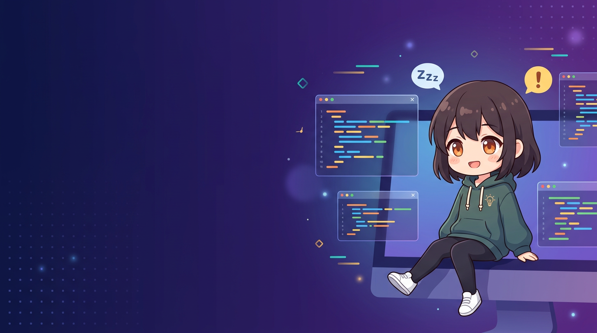

<div align="center">



# 开工啦 (Duty On) - Live2D 桌面精灵监控

**让喜欢的角色替你盯梢——AI 在忙什么，一眼就知道。**

[English](README.md) · **简体中文**

### 🎉 v1.1.9 — 多屏吸附修复 + ZIP 分发！

> **为中国 Trae 用户量身打造** — 原生 Trae CN / TraeCode CN 窗口标题识别，
> 自动剥离多根工作区后缀（工作区 / Workspace / ワークスペース / 작업 영역），
> 8 种语言、简体中文优先。
>
> **v1.1.9 更新：** 修复跨屏边缘吸附时窗口反复横跳最终消失的故障
> （"最大面积优先" snap_target、内部边界规范化、目标显示器 DPI、active 竞态、20px 滞后防闪）；
> 新增 Live2D 封面生成器；启动打印显示器信息。改为 **ZIP 分发**，避免 Windows SmartScreen 拦截未签名 exe。
> [下载 v1.1.9 (.zip) →](https://github.com/marine841023/duty-on/releases/download/v1.1.9/DutyOn-v1.1.9.zip)

</div>

---

同时开着好几个 IDE 跑 AI 任务，还要不停 Alt-Tab 检查它们是在干活、干完了、还是卡在等你确认？
「开工啦」是一个透明悬浮的 Live2D 小人儿，**为中国 Trae 用户量身打造**，
把所有 **Trae** / Qoder / Cursor / Codex / OpenCode 会话的实时状态浓缩在一个表情上：

- 💤 **睡觉**：所有 IDE 空闲时，精灵闭眼睡觉，飘出 ZZZ
- ⚡ **忙碌**：有 AI 任务正在执行时，精灵睁眼专注工作
- 🔔 **提醒**：需要你确认操作时，精灵抖动并弹出感叹号

基于 **Tauri 2.0 + Rust** 构建（系统 WebView，无 Chromium），跨 Windows / macOS / Linux，
内存占用约 80MB——同类 Electron 方案的 1/5。

## 功能

- **Live2D 精灵**：浮在桌面最顶层的透明无边框窗口，支持拖拽移动、位置记忆
- **状态栏**：精灵下方显示所有已连接的 IDE 项目及状态，带 T/Q/C/X/O 徽章区分 Trae/Qoder/Cursor/Codex/OpenCode
- **点击跳转**：点击状态栏中的项目名，自动激活对应的 IDE 窗口
- **多 IDE 支持**：同时监控多个 **Trae** / Qoder / Cursor / Codex / OpenCode 实例，5 种 IDE 各有原生 Hook 集成
- **智能点击穿透**：光标落在模型/菜单上时可点击，其余区域鼠标事件穿透到下层窗口
- **迷你模式**：一键缩小为 130×210 的桌面角落小伙伴（菜单切换，双向还原）
- **高清渲染**：超采样渲染（2x 分辨率缓冲），高 DPI 屏幕下边缘锐利
- **21 个内置动作**：点击精灵随机触发，菜单可点播任意动作，状态机自动联动
- **自定义模型**：把任意 Cubism 4 模型放进 `~/.dutyon/live2d/` 即可在菜单中切换
- **多语言**：简中/繁中/英/日/韩/法/德/西（自动跟随系统语言）
- **开机自启**：菜单一键开关（Windows 注册表 / macOS LaunchAgent / Linux autostart）

## 快速开始

### 方式一：下载安装包（推荐）

从 [Releases](https://github.com/marine841023/duty-on/releases) 下载 **`.zip`** 压缩包，
解压后运行里面的 `DutyOn_<版本>_x64-setup.exe` 安装（当前用户安装，含简/繁中/英/日/韩语言选择）。
采用 ZIP 分发以避免 Windows SmartScreen 拦截未签名 exe。macOS / Linux 请从源码构建。

### 方式二：从源码构建

环境要求：[Rust](https://rustup.rs/)（stable）、Tauri CLI（`cargo install tauri-cli --version "^2"`）、
[各平台依赖](https://v2.tauri.app/start/prerequisites/)。前端是纯静态文件，无需 npm/构建步骤。

```bash
git clone https://github.com/marine841023/duty-on.git
cd duty-on/src-tauri
cargo tauri dev      # 开发模式（自动打开 DevTools）
cargo tauri build    # 打包：产物在 target/release/bundle/
```

### 安装 Hook 集成

右键精灵菜单 → **安装 Hook 集成**（或运行 `hooks/install-hooks.ps1`），
然后**重启 IDE 或开启新的 AI 会话**即可生效。
桥接脚本：`hooks/trae-hook-bridge.ps1`（Windows）、`hooks/trae-hook-bridge.sh`（macOS/Linux）。

## 工作原理

```
┌─────────────────────────────────────────────┐
│       DutyOn (Tauri 2.0 桌面应用)            │
│  ┌───────────────────────────────────────┐  │
│  │  前端: Live2D 精灵 (pixi-live2d)       │  │
│  │  状态: 💤 睡觉 / ⚡ 忙碌 / 🔔 提醒     │  │
│  ├───────────────────────────────────────┤  │
│  │  Rust 后端:                            │  │
│  │  · 状态机 (多会话追踪 + 超时清理)       │  │
│  │  · HTTP Server (127.0.0.1:17521)      │  │
│  │  · IDE 窗口扫描 (检测 IDE 关闭)        │  │
│  │  · 点击穿透轮询 (30ms 光标位置)        │  │
│  └───────────────────────────────────────┘  │
└──────────────────┬──────────────────────────┘
                   │ HTTP POST /hook (localhost)
   ┌───────┬───────┼───────┬───────┬───────┐
┌──┴──┐ ┌──┴──┐ ┌──┴──┐ ┌──┴──┐ ┌──┴────┐
│Trae │ │Qoder│ │Cursor│ │Codex│ │OpenCode│
└─────┘ └─────┘ └─────┘ └─────┘ └───────┘
```

### Hook 事件映射

| Hook 事件 | 触发时机 | 精灵状态 |
|-----------|---------|---------|
| `SessionStart` | IDE 会话创建 | 项目上线 (idle) |
| `UserPromptSubmit` | 用户发送消息 | → 忙碌 (working) |
| `PreToolUse` / `PostToolUse` | AI 工具执行前/后 | → 忙碌 (working) |
| `Notification` | 需要用户确认 | → 提醒 (alert) |
| `Stop` | AI 完成任务 | → 空闲 (idle) |
| `PreToolUse`(AskUserQuestion) _(Qoder)_ | Qoder 弹出问答 | → 提醒 (alert) |
| `PermissionRequest` _(Qoder)_ | Qoder 请求权限 | → 提醒 (alert) |
| `PermissionRequest` _(Codex)_ | Codex CLI 请求权限 | → 提醒 (alert) |
| `permission.ask` _(OpenCode)_ | OpenCode 请求权限 | → 提醒 (alert) |

整体状态优先级：alert > working > sleeping。模糊 `Notification` 默认按"任务完成"处理
（白名单见 `src-tauri/src/config.rs`）。

## 自定义 Live2D 模型

把模型目录放到 `~/.dutyon/live2d/<名字>/`（含 `<名字>.moc3` + 贴图 + `model3.json` + 动作），
精灵菜单的"切换形象"里立刻就能看到。用户模型通过本地回环服务器
（`http://127.0.0.1:17521/live2d/...`）加载——Tauri asset 协议的响应不带 CORS 头，
cubism4/pixi 的 XHR 加载器会预检失败，详见[技术说明](docs/technical-notes.md)。

## 测试

```bash
cd src-tauri
cargo test    # 87 个单元测试（状态机/Hook合并/服务器/点击穿透/扫描器）
```

端到端回归脚本（需先启动精灵）：`.userdata/test-flow.ps1`、`.userdata/test-notification.ps1`。

## API 接口

本地 HTTP 服务器 (`http://127.0.0.1:17521`)：

| 接口 | 方法 | 说明 |
|------|------|------|
| `/hook` | POST | 接收 Hook 事件 |
| `/status` | GET | 当前状态快照 |
| `/health` | GET | 健康检查 |
| `/unregister` | POST | 注销会话 |
| `/log` | POST | 前端诊断日志转发（落盘 `~/.dutyon/frontend.log`） |
| `/live2d/*path` | GET | 用户 Live2D 模型文件（带 CORS） |

## 技术栈

- **Tauri 2.0** — 桌面应用框架（系统 WebView2 / WKWebView / WebKitGTK）
- **Rust** — tokio + axum（HTTP）、serde、regex；平台层 windows crate / core-graphics / x11rb
- **PixiJS v7 + pixi-live2d-display + Cubism Core** — Live2D 渲染
- **Trae / Qoder / Cursor / Codex / OpenCode Hooks** — 5 种 IDE 的 AI 生命周期事件钩子

## 常见问题

**Q: 精灵不显示 Live2D 模型？**
A: 开发模式查看 DevTools 控制台；发布版诊断日志在 `~/.dutyon/frontend.log`。

**Q: Hook 安装后没有反应？**
A: 确保重启了 IDE 或开启了新的 AI 会话；菜单 → "Hook 状态"可查看诊断。

**Q: 精灵一直显示睡觉？**
A: 检查 `http://127.0.0.1:17521/health` 是否存活，并确认 Hook 已安装。

**Q: AI 完成了却显示"需要确认"？**
A: 模糊 Notification 默认按完成处理；如需触发提醒，将 `config.rs` 中
`ALERT_ON_AMBIGUOUS_NOTIFICATION` 设为 `true`。

**Q: Wayland 下点击穿透不工作？**
A: Wayland 无全局光标 API，降级为"始终可点击"（X11 正常）。

**Q: 自定义模型切换失败？**
A: 看 `~/.dutyon/frontend.log` 里的 `[live2d]` 日志行；确认模型目录结构完整。

## 许可证

代码：[MIT](LICENSE)。内置 Live2D 运行时与示例模型 © Live2D Inc.，按其各自许可证使用——见 [NOTICE](NOTICE)。
